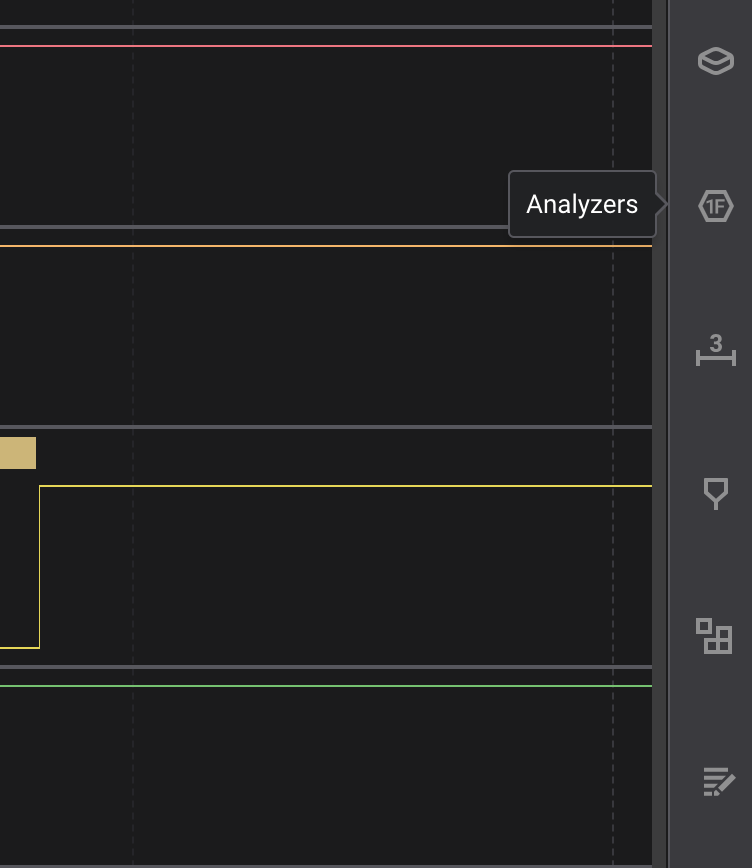
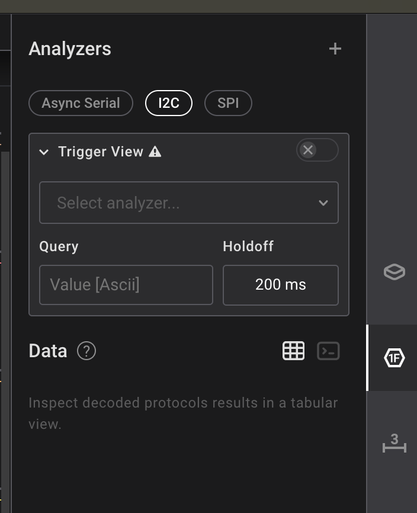
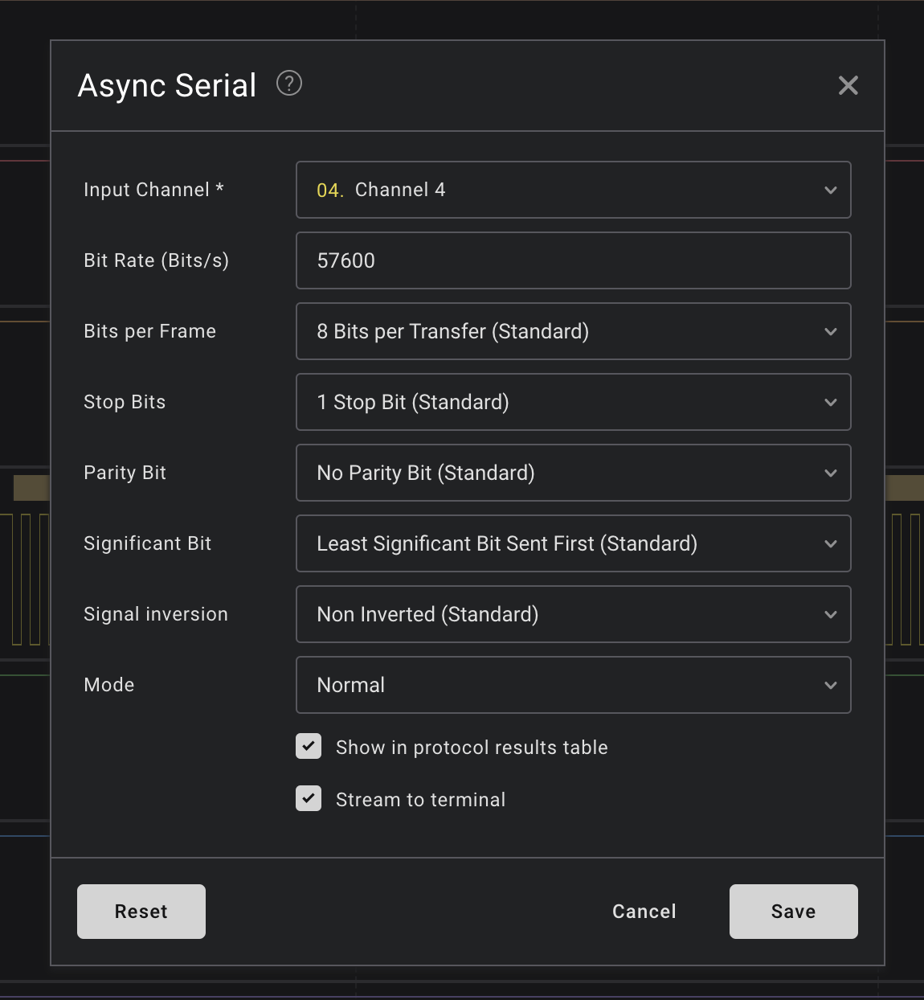
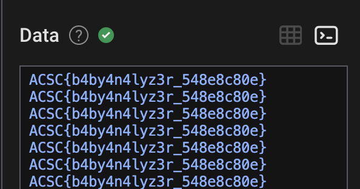

# An4lyz3_1t

配布ファイルを`file`コマンドで見てみると、
zipとして展開できそうなことがわかるので、展開されたファイルを確認すると、`SALEAE`という文字が見える。

SaleaeのLogicでキャプチャされたUARTをデコードする問題のようである。

## UART(Univarsal Asynchronous Receiver Transmitter)
> 

UARTとは、クロック信号を使用しないでデータを転送するタイミングを揃えないシリアル通信である。
UARTはクロック信号を使用しないため、通信を送受信するデバイス間でBaud Rate（通信速度）を決めておく必要がある。
このボーレートによって、やり取りできるbit数が決まる。

よく使われるボーレートは以下の通りらしい。
- 9600bps
- 38400bps
- 19200bps
- 57600bps
- 115200bps

# 解法

Logic2を開くと、右側にタブがある。その中の上から二番目の`Analysers`を選ぶ。

`Analysers`の中にある`Async Serial`を選択する。

次のようなモーダルが開くので、上に示したボーレートを総当りしてみると、57600bpsのときフラグが得られた。

`ACSC{b4by4n4lyz3r_548e8c80e}`

UARTのボーレートの特定は、総当たりが無難っぽい。

参考文献
- https://emb.macnica.co.jp/articles/8191/
- https://book.hacktricks.xyz/v/jp/todo/hardware-hacking/uart#uartbrtono

