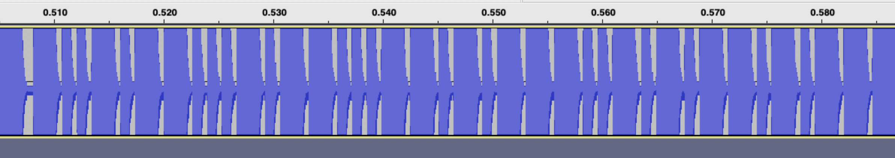

# RFID_Demod
> We have obtained analog trace captured by sniffing a rfid writer when it is writing on a T5577 tag. Can you help us find what DATA is being written to it?

問題文にある`RFID T5577 tag`について調べると、[RfidResearchGroup/proxmark3/doc/T5577_Guid.md](https://github.com/RfidResearchGroup/proxmark3/blob/master/doc/T5577_Guide.md)が見つかる。（データシート： [Atmel-9187-RFID-ATA5577C_Datasheet.pdf](https://ww1.microchip.com/downloads/en/DeviceDoc/Atmel-9187-RFID-ATA5577C_Datasheet.pdf) ）

配布ファイルは`.wav`なので`Audacity`で開くと次のような波形が見える。


データシートの`5.12 Reader to Tag Communication`に次のような記述がある。
> Choosing the default downlink protocol (fixed-bit-length protocol), the time between two gaps is nominally 24 field clocks for a 0 and 56 field clocks for a 1. 

したがって、短い波形は`0`、長い波形は`1`として解釈すると以下のようになる。

```
10010110001011000110101110010101101011
```

`5.12.2 Downlink Data Protocols`に、このビットに関するルールが記述されている。

> Standard write needs the opcode, the lock bit, 32 data bits and the 3-bit address (38 bits total)

オペコード（2bit）+ ロックビット（1bit）+ 32bit データ + アドレス（3bit）の合計38bitで構成されるようだ。32ビットのデータを取り出して書き込んだデータを求める。

```python
>>> hex(0b10110001011000110101110010101101)
'0xb1635cad'
```

`ACSC{B1635CAD}`
